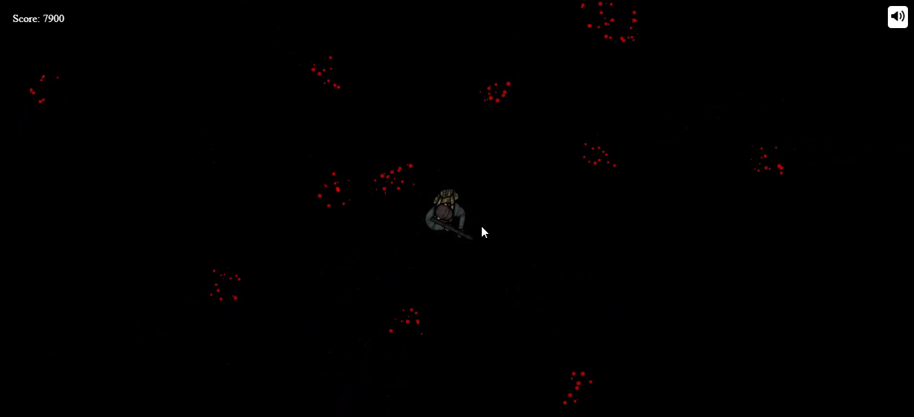

<h1>Zombie Game</h1>

## 🚨 Tutorial

This repository contains the code corresponding to an in-depth tutorial available on our YouTube channel, <a href="https://www.youtube.com/@ChrisCourses/videos" target="_blank"><b>Chris Courses</b></a>. 

If you prefer visual learning, this is the perfect resource for you. Follow our tutorial to learn how to build projects like these step-by-step in a beginner-friendly manner!

<a href="https://www.youtube.com/watch?v=eI9idPTT0c4" target="_blank"></a>

## <a name="introduction">🤖 Introduction</a>

Zombie Game Using Canvas and Vanilla JavaScript

There is a soldier surrounded by zombies and he must get rid of them to save his life.
The game is played with the mouse; left-click to shoot zombies.
Right-click to kill all zombies, but you must have a score bigger than 5000.

<a href="https://mo0hamedradwan.github.io/Zombie-Game">Play Now</a>




## <a name="tech-stack">⚙️ Tech Stack</a>

- HTML
- CSS
- Vanilla Javascript
- Canvas

## <a name="features">🔋 Features</a>

👉 **Create Player (Soldier)**

👉 **Shoot Projectiles**

👉 **Create Enemy (Zombies)**

👉 **Detect Collision on Enemy / Projectile hit**

👉 **Detect Collision on Enemy / Player**

👉 **Shrink Enemies on hit**

👉 **Create Particle Explosion ob hit**

👉 **Add Score**

👉 **Add Game Over UI**

👉 **Add Start/Restart Game Button**

👉 **Add Audio Control Button**


## <a name="quick-start">🤸 Quick Start</a>

Follow these steps to set up the project locally on your machine.

**Prerequisites**

Make sure you have the following installed on your machine:

- [Git](https://git-scm.com/)
- [Node.js](https://nodejs.org/en)
- [npm](https://www.npmjs.com/) (Node Package Manager)

**Cloning the Repository**

```bash
git clone https://github.com/mo0hamedRadwan/Zombie-Game.git
cd Zombie-Game
```

**Installation**

Install the project dependencies using npm:

```bash
npm install
```


**Running the Project**

```bash
npm start
```

Open [http://localhost:8000](http://localhost:8000) in your browser to view the project.
